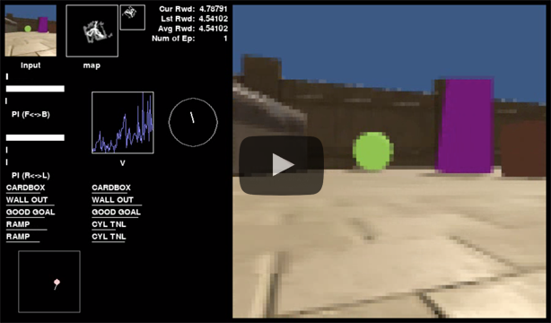

# AnimalAI Olympics agent for Inf-mnky team

### Supervised allocentric position estimation

Please see `train/allocentric/` directory.

### Starting position relative agent position/angle calculation

Please see `train/allocentric/integrator.py`

### Supervised LIDAR training

Please see `train/lidar/` directory.

### Map creation with LIDAR information

Please see `train/trainers/visited_map.py`

### Agent visualizer

Please see `train/dislay.py`

### Customized Unity environment

Please see `unity/` directory

